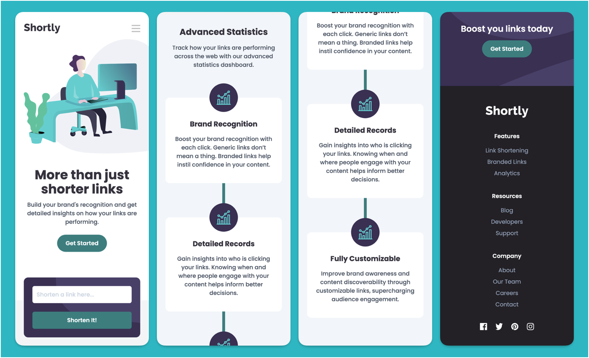
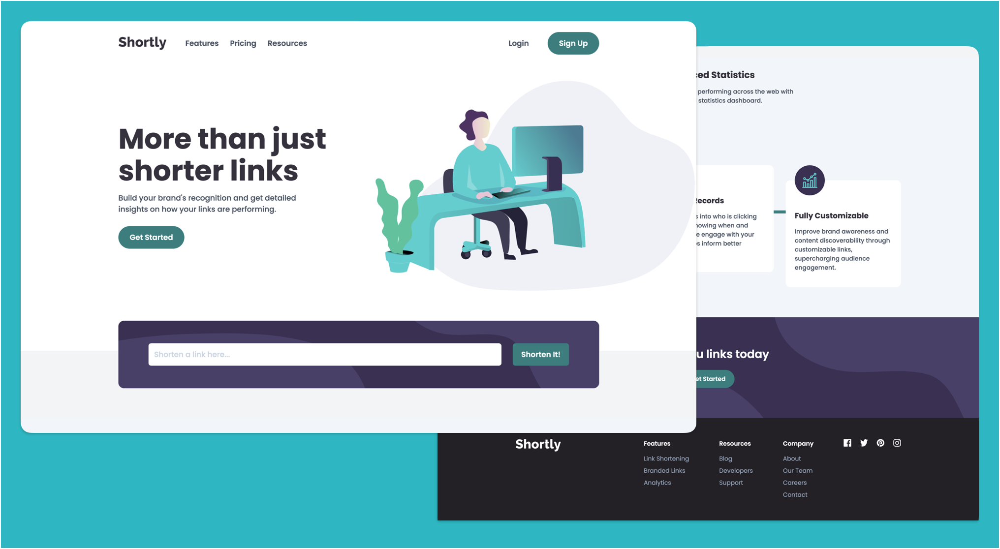

# Frontend Mentor - Shortly URL shortening API Challenge solution

This is a solution to the [Shortly URL shortening API Challenge challenge on Frontend Mentor](https://www.frontendmentor.io/challenges/url-shortening-api-landing-page-2ce3ob-G). Frontend Mentor challenges help you improve your coding skills by building realistic projects. 

## Table of contents

- [Overview](#overview)
  - [The challenge](#the-challenge)
  - [Screenshot](#screenshot)
  - [Links](#links)
- [My process](#my-process)
  - [Built with](#built-with)
  - [What I learned](#what-i-learned)
  - [Continued development](#continued-development)
  - [Useful resources](#useful-resources)
- [Author](#author)

## Overview

### The challenge

Users should be able to:

- View the optimal layout for the site depending on their device's screen size
- Shorten any valid URL
- See a list of their shortened links, even after refreshing the browser
- Copy the shortened link to their clipboard in a single click
- Receive an error message when the `form` is submitted if:
  - The `input` field is empty

### Screenshot

### Links

- Solution URL: [Frontend Mentor](https://www.frontendmentor.io/solutions/shortly-url-shortening-app-with-react-vite-typescript-and-motion-ZBhiQJzNbU)
- Live Site URL: [See it live](https://ourshortlink.netlify.app/)

## My process

### Built with

- React.Js + Vite
- Typescript
- Tailwind CSS
- Zustand
- Axios
- Motion (Framer Motion)
- Flexbox
- CSS Grid
- Mobile-first workflow
- [React](https://reactjs.org/) - JS library
- [Vite](https://vite.dev/) - React framework
- [TailwindCSS](https://tailwindcss.com/docs/installation/using-vite) - For styles
- [Zustand](https://zustand.docs.pmnd.rs/) - For state management
- [Motion](https://motion.dev/) - For animation

### Continued development

Future update mights involves migrating from cleanuri API to our own API.

## Author

- Frontend Mentor - [@codesbyree](https://www.frontendmentor.io/profile/codesbyree)
- Twitter - [@growth_ree](https://x.com/growth_ree)
- Instagram - [@codesbyree](https://www.instagram.com/codesbyree/)
